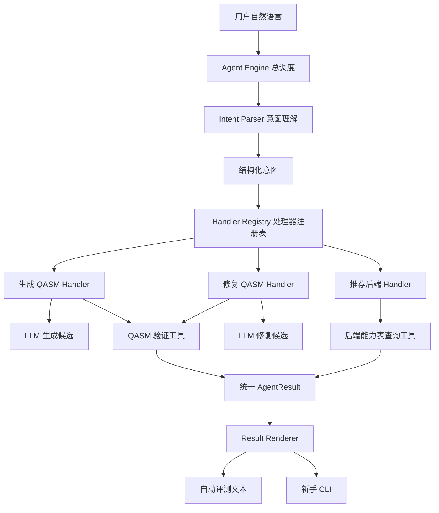

# L2 Agent 架构设计

## 这份文档写给谁

这份文档面向第一次搭建 Agent 的开发者。它不假设读者了解 Agent 框架、工具调用或结构化输出，只需要会阅读基本的 Python 代码。

LoomQ L2 要做的事情，可以用一句话概括：

> 用户用自然语言提出量子计算需求，模型负责听懂，程序负责执行和检查，最后返回评测器与普通用户都能理解的结果。

我们采用 **Handler 插件结构**。它把 Agent 想象成一个服务中心：

- LLM 是前台接待，负责听懂用户在说什么；
- 结构化意图是一张标准工单；
- Handler 是处理不同任务的专业部门；
- Tool 是各部门共用的工具箱；
- Agent Engine 是总调度员；
- Renderer 是交付人员，负责整理最终答案。

这种结构不会把所有逻辑堆进一个巨大的 `agent_chat()`，也方便以后增加新的任务。

## L2 要交付什么

### 客观部分，最高 20 分

必须在 `starter_kit/adapter.py` 中实现：

```python
def agent_chat(prompt: str) -> str:
    ...
```

正式评测器会直接调用这个函数。每个 case 必须：

- 从 `LOOMQ_LLM_*` 环境变量读取模型服务配置；
- 至少完成一次有效模型调用；
- 在 120 秒内返回字符串；
- 正确处理自然语言生成 QASM、修复 QASM、推荐后端三类任务；
- 不依赖组委会模型服务以外的外部网络；
- 不通过公开样例关键词或预设答案表作弊。

### 交互体验部分，最高 10 分

在自动评测入口之外，提供一个零基础用户能够现场操作的入口。第一版采用引导式 CLI：

```bash
python3 agent_cli.py
```

CLI 和自动评测必须复用同一个 Agent 核心，不能维护两套互不一致的业务逻辑。

## Agent 到底是什么

普通聊天程序通常只有一步：

```text
用户 → 模型 → 回答
```

Agent 在模型与最终回答之间加入了行动和检查：

```text
用户提出需求
    ↓
模型理解需求并给出结构化工单
    ↓
程序选择合适的 Handler
    ↓
Handler 调用解析器、能力表或模拟器
    ↓
程序检查结果
    ↓
必要时让模型修正一次
    ↓
返回最终答案
```

因此，Agent 并不一定需要一个复杂的第三方框架。一段职责清晰、能调用模型和工具、能根据工具结果继续行动的 Python 控制流程，就是一个真正的 Agent。

## 总体架构



最重要的分工是：

| 工作 | 负责者 |
|---|---|
| 理解自然语言 | LLM |
| 判断任务类型 | LLM |
| 提取比特数、目标态和约束 | LLM |
| 生成或修复 QASM 候选 | LLM |
| 检查 QASM 语法 | Python + 现有 L1 Parser |
| 判断后端是否满足条件 | Python + 官方能力表 |
| 控制超时和重试 | Python |
| 保证最终答案格式稳定 | Python Renderer |

模型处理模糊的语言，普通代码处理精确的规则。不要让模型负责所有事情。

## 一次请求如何流转

以用户请求为例：

> 我要运行一个 20 比特电路，必须免费，而且不能排队。

### 第一步：`adapter.py` 接收请求

正式评测器调用：

```python
reply = adapter.agent_chat(prompt)
```

`adapter.py` 只做薄封装：

```python
def agent_chat(prompt: str) -> str:
    return l2_agent.respond(prompt)
```

### 第二步：模型生成结构化意图

模型阅读完整请求，并返回类似：

```json
{
  "task_type": "recommend_backend",
  "user_goal": "选择一个可运行 20 比特电路的免费无排队后端",
  "backend_constraints": {
    "min_qubits": 20,
    "kind": null,
    "queue": "none",
    "cost": "free",
    "requires_account": null
  }
}
```

这份 JSON 就是结构化意图，也可以理解成一张工单。后面的 Python 不需要再理解“不能排队”这句话，只需要检查 `queue == "none"`。

### 第三步：Registry 找到 Handler

```python
handler = registry.get("recommend_backend")
```

Registry 返回 `RecommendBackendHandler`。

### 第四步：Handler 调用工具

Handler 把结构化约束交给 Backend Selector。Selector 读取 `backend_capabilities.json`，根据比特数、排队和费用逐项筛选。

### 第五步：生成统一结果

```python
AgentResult(
    ok=True,
    task_type="recommend_backend",
    backend_id="spinq_taurus_simulator",
    explanation="支持 20 比特、免费且无排队。",
)
```

### 第六步：Renderer 生成文本

```text
推荐后端：spinq_taurus_simulator

它支持最多 24 比特，并且免费、无排队、无需账号，满足你的要求。
```

这里已经完成了一次真实模型调用，但最终后端不是模型拍脑袋决定的，而是程序从官方能力表计算出来的。

## 结构化意图

用户的表达方式千变万化，程序不能依靠查找 `GHZ`、`贝尔态` 或 `不排队` 等关键词来判断答案。Intent Parser 应让模型阅读完整语义，并输出统一 JSON。

建议的统一格式是：

```json
{
  "task_type": "generate_qasm",
  "user_goal": "用户目标的简短总结",
  "circuit": {
    "target_state": null,
    "qubits": null,
    "measure_all": null
  },
  "source_qasm": null,
  "backend_constraints": {
    "min_qubits": null,
    "kind": null,
    "queue": null,
    "cost": null,
    "requires_account": null
  },
  "candidate_qasm": null,
  "explanation": null
}
```

三种任务共用一个外层结构，只填写自己需要的字段。

### 生成任务示例

用户输入：

> 生成一个 4 比特 GHZ 态，并测量所有量子比特。

模型输出：

```json
{
  "task_type": "generate_qasm",
  "user_goal": "生成并测量 4 比特 GHZ 态",
  "circuit": {
    "target_state": "ghz",
    "qubits": 4,
    "measure_all": true
  },
  "source_qasm": null,
  "backend_constraints": null,
  "candidate_qasm": "OPENQASM 2.0;\ninclude \"qelib1.inc\";\n...",
  "explanation": "先建立叠加，再将四个量子比特纠缠起来。"
}
```

### 修复任务示例

```json
{
  "task_type": "repair_qasm",
  "user_goal": "制备并测量一个贝尔态",
  "circuit": {
    "target_state": "bell",
    "qubits": 2,
    "measure_all": true
  },
  "source_qasm": "H q[0];\nCX q[0] q[1]",
  "backend_constraints": null,
  "candidate_qasm": "OPENQASM 2.0;\ninclude \"qelib1.inc\";\n...",
  "explanation": "补充了寄存器声明并修正了 cx 格式。"
}
```

程序必须对模型 JSON 做检查，不能直接信任它：

```python
ALLOWED_TASKS = {
    "generate_qasm",
    "repair_qasm",
    "recommend_backend",
}

if intent.get("task_type") not in ALLOWED_TASKS:
    raise ValueError("模型返回了未知任务类型")
```

## Agent Engine：总调度员

Agent Engine 负责：

- 检查输入是否合法；
- 创建本次请求的工作上下文；
- 调用 Intent Parser；
- 从 Registry 查找 Handler；
- 运行 Handler；
- 控制总时间和模型调用次数；
- 将统一结果交给 Renderer；
- 捕获错误并返回安全信息。

它不负责具体生成 QASM 或筛选后端。核心流程应保持简短：

```python
def respond(prompt: str) -> str:
    context = create_context(prompt)
    intent = understand_intent(prompt, context)

    handler = handler_registry.get(intent.task_type)
    if handler is None:
        return render_unsupported_task(intent)

    result = handler.execute(intent, context)
    return render_result(result)
```

`context` 是各 Handler 共用的工作环境，可以包含：

- 原始用户输入；
- 本次请求的截止时间；
- 已使用的模型调用次数；
- LLM Gateway；
- QASM Validator；
- Backend Selector；
- Circuit Runner。

## Handler：独立任务处理器

每个 Handler 只负责一种任务，并遵守相同接口：

```python
class TaskHandler:
    task_type: str

    def execute(self, intent, context):
        raise NotImplementedError
```

输入是结构化意图和公共工具，输出是统一 `AgentResult`。

### GenerateQasmHandler

工作流程：

```text
读取候选 QASM
    ↓
调用 QASM Validator
    ↓
验证成功 → 返回
    ↓
验证失败 → 把准确错误交给模型修复一次
    ↓
重新验证
    ↓
返回成功结果或清晰错误
```

伪代码：

```python
class GenerateQasmHandler(TaskHandler):
    task_type = "generate_qasm"

    def execute(self, intent, context):
        qasm = intent.candidate_qasm
        validation = context.qasm_validator.validate(qasm)

        if not validation.ok:
            qasm = context.llm.repair_qasm(
                user_goal=intent.user_goal,
                broken_qasm=qasm,
                error=validation.error,
            )
            validation = context.qasm_validator.validate(qasm)

        if not validation.ok:
            return AgentResult.failure(
                task_type=self.task_type,
                message="生成的电路未通过验证。",
                details=validation.error,
            )

        return AgentResult.success(
            task_type=self.task_type,
            qasm=qasm,
            explanation=intent.explanation,
        )
```

### RepairQasmHandler

修复任务不能只让语法通过，还必须保留用户声明的实验目标。调用模型修复时，要同时提供：

- 用户原始请求；
- 用户声明的目标态；
- 原始错误代码；
- 当前候选代码；
- Parser 返回的准确错误；
- LoomQ 支持的语法和量子门。

例如语法正确的 `x q[0]` 电路并不等于贝尔态，所以“能解析”只是最低要求，不代表语义正确。

### RecommendBackendHandler

模型只提取约束，不直接决定最终后端。Handler 调用 Backend Selector，从官方能力表计算答案：

```python
class RecommendBackendHandler(TaskHandler):
    task_type = "recommend_backend"

    def execute(self, intent, context):
        matches = context.backend_selector.find_matches(
            intent.backend_constraints
        )

        if not matches:
            return AgentResult.no_match(
                task_type=self.task_type,
                constraints=intent.backend_constraints,
                message="当前没有满足全部条件的后端。",
            )

        return AgentResult.success(
            task_type=self.task_type,
            backend_id=matches[0]["id"],
            backend=matches[0],
            alternatives=matches[1:],
        )
```

## Handler Registry：处理器通讯录

Registry 记录当前 Agent 支持哪些任务：

```python
HANDLERS = {}


def register_handler(handler):
    HANDLERS[handler.task_type] = handler


def get_handler(task_type):
    return HANDLERS.get(task_type)
```

启动时注册：

```python
register_handler(GenerateQasmHandler())
register_handler(RepairQasmHandler())
register_handler(RecommendBackendHandler())
```

以后增加“解释模拟结果”任务，只需新增并注册：

```python
class ExplainResultHandler(TaskHandler):
    task_type = "explain_result"

    def execute(self, intent, context):
        return context.result_explainer.explain(intent.counts)


register_handler(ExplainResultHandler())
```

Agent Engine 不需要增加一大串 `if/elif`。当然，还需要更新意图 Schema 和 Prompt，让模型知道系统拥有了这个新能力。

## Tool：Handler 共用的工具箱

### QASM Validator

QASM Validator 负责：

- 检查 QASM 是否为非空字符串；
- 提取并清理 Markdown 代码围栏；
- 检查是否包含 `OPENQASM 2.0;`；
- 调用现有 `parse_qasm()`；
- 检查是否只使用 L1 支持的门；
- 发现寄存器缺失、下标越界和错误测量；
- 调用 `transpile()` 检查能否进入 L1 流程；
- 返回统一的成功或失败结构。

示例返回：

```json
{
  "ok": false,
  "error_type": "parse_error",
  "error": "cx expects 2 qubits",
  "qasm": "..."
}
```

Validator 只检查候选程序，不擅自修改用户意图。安全的格式清理可以自动完成，但不能把 `x q[1]` 猜成 `x q[0]`。

### Backend Selector

Backend Selector 直接加载官方 `backend_capabilities.json`，根据以下约束筛选：

- 最小量子比特数；
- 模拟器、真机或云端类型；
- 是否允许排队；
- 是否允许付费；
- 是否允许注册账号。

多解时使用稳定排序：

1. 满足全部显式约束；
2. 无账号优先；
3. 免费优先；
4. 无排队优先；
5. 在满足比特数的情况下，不过度浪费能力；
6. 最后按后端 ID 排序，保证可复现。

如果没有满足所有条件的后端，应明确说明无解，并给出替代方向，不能虚构一个答案。

### LLM Gateway

所有模型请求都经过同一个 LLM Gateway，而不是由各 Handler 自己发送 HTTP 请求：

```python
class LLMGateway:
    def understand(self, prompt, timeout):
        ...

    def repair_qasm(self, goal, qasm, error, timeout):
        ...
```

Gateway 复用 `llm_client.py`，统一处理：

- `LOOMQ_LLM_BASE_URL`；
- `LOOMQ_LLM_API_KEY`；
- `LOOMQ_LLM_MODEL`；
- 请求超时；
- `temperature=0`；
- DeepSeek thinking 配置；
- API 响应结构检查；
- 错误信息脱敏。

API Key 不能进入日志、异常文本或证据文件。

### Circuit Runner

Circuit Runner 主要服务现场 CLI，可以调用现有：

```python
run(qasm, target, shots)
```

它把结果交给 CLI 显示为简单柱状图。客观 L2 评测只需要返回 QASM 或后端 ID，不应为了展示功能强制每个 case 都运行模拟器。

## 统一 AgentResult

不同 Handler 的工作不同，但应该返回同一种数据结构：

```python
@dataclass
class AgentResult:
    ok: bool
    task_type: str
    message: str = ""
    qasm: str | None = None
    backend_id: str | None = None
    explanation: str | None = None
    alternatives: list | None = None
    validation: dict | None = None
```

生成成功：

```python
AgentResult(
    ok=True,
    task_type="generate_qasm",
    qasm="OPENQASM 2.0;\n...",
    explanation="这个电路会创建三比特纠缠态。",
    validation={"syntax": "passed"},
)
```

推荐成功：

```python
AgentResult(
    ok=True,
    task_type="recommend_backend",
    backend_id="spinq_taurus_simulator",
    explanation="支持 20 比特、免费且无排队。",
)
```

统一结果让自动评测和 CLI 可以复用同一套业务逻辑。

## Result Renderer：同一结果，两种展示

### 自动评测文本

评测器需要稳定、容易提取的文本。QASM 任务使用：

````text
已生成并通过 LoomQ 验证。

```qasm
OPENQASM 2.0;
include "qelib1.inc";
qreg q[3];
creg c[3];
h q[0];
cx q[0],q[1];
cx q[1],q[2];
measure q -> c;
```
````

后端推荐使用：

```text
推荐后端：spinq_taurus_simulator

理由：支持 20 比特、免费、无需账号且没有排队。
```

规范后端 ID 必须完整出现。最终格式由 Python 模板生成，不再额外调用模型。

### 新手 CLI

同一个结果在 CLI 中可以显示得更友好：

```text
✓ 我理解了你的需求
  创建一个 3 比特纠缠实验，并测量所有量子比特

✓ 已生成 OpenQASM 2.0
✓ 语法验证通过
✓ 可以进入 LoomQ 转译流程

接下来你想：
1. 查看代码
2. 在本地模拟器运行
3. 转换到另一个平台
4. 用自然语言继续修改
```

运行结果可以用零依赖 ASCII 柱状图展示：

```text
000  ███████████████████  50.4%
111  ██████████████████   49.6%
```

再补充一句零基础解释：

> 结果几乎只出现 000 和 111，说明三个量子比特形成了强关联；每次运行会随机得到其中一个结果。

## Prompt 设计

第一版只需要两套 Prompt。

### 主 Prompt

负责：

- 判断三种任务之一；
- 总结用户目标；
- 提取比特数、目标态和测量要求；
- 提取后端约束；
- 对生成或修复任务提供完整 QASM 候选；
- 严格返回指定 JSON。

Prompt 中要明确：

- 支持的任务类型；
- JSON 输出 Schema；
- OpenQASM 2.0 必备头部；
- L1 支持的 12 种门；
- 寄存器、分号和测量格式；
- 修复时必须保持用户声明目标；
- 后端任务只提取约束，不虚构后端能力；
- 不输出 JSON 之外的文字。

### 修复 Prompt

仅在第一次 QASM 验证失败时调用，输入包括：

- 用户原始请求；
- 用户声明目标；
- 当前候选 QASM；
- Parser 的准确错误；
- 支持的语法和门。

要求模型保持原始意图，返回完整可执行的 OpenQASM 2.0。

## 模型调用次数与超时

正式评测每个 case 最多 120 秒。第一版不允许 Agent 无限循环：

```python
MAX_MODEL_CALLS = 2
MAX_REPAIR_ATTEMPTS = 1
```

建议时间预算：

- 首次模型调用最多约 75 秒；
- 本地解析与验证最多约 5 秒；
- 必要时修复调用使用剩余时间，最多约 35 秒；
- 预留约 5 秒整理结果。

后端推荐只需要一次模型调用。QASM 生成和修复只有第一次结果未通过验证时，才允许第二次调用。

## 为什么这不是关键词伪 Agent

禁止的实现是：

```python
if "GHZ" in prompt and "3 比特" in prompt:
    return PREWRITTEN_GHZ3_QASM
```

或者：

```python
ANSWERS = {
    "生成一个 3 比特 GHZ 态": GHZ3_QASM,
    "修复贝尔态": BELL_QASM,
}
```

这些代码只记住了公开题目，换一种措辞、比特数或目标态就会失败。

本方案的通用处理过程是：

```text
LLM 理解完整语义
    ↓
提取目标态、比特数、测量要求或后端约束
    ↓
模型生成新候选，或程序根据约束计算
    ↓
通用 Parser 和能力表验证
    ↓
返回结果
```

读取官方能力表也不是“打表作弊”。能力表是领域事实数据；我们根据任意新约束实时筛选，而不是保存公开问题与答案的映射。

合理的通用规则包括：

```python
if backend["max_qubits"] < constraints["min_qubits"]:
    continue
```

```python
if parse_qasm(qasm) raises ValueError:
    request_repair()
```

判断标准是：更换措辞、比特数、目标态或错误代码后，同一套规则是否仍能计算出结果。

## 推荐目录结构

```text
starter_kit/
├── adapter.py
├── llm_client.py
├── backend_capabilities.json
├── agent_cli.py
│
├── l2_agent/
│   ├── __init__.py
│   ├── agent.py
│   ├── context.py
│   ├── models.py
│   ├── prompts.py
│   ├── intent_parser.py
│   ├── registry.py
│   ├── renderer.py
│   │
│   ├── handlers/
│   │   ├── __init__.py
│   │   ├── base.py
│   │   ├── generate_qasm.py
│   │   ├── repair_qasm.py
│   │   └── recommend_backend.py
│   │
│   └── tools/
│       ├── __init__.py
│       ├── qasm_validator.py
│       ├── backend_selector.py
│       └── circuit_runner.py
│
└── tests/
    ├── test_l2_intent_parser.py
    ├── test_l2_qasm_validator.py
    ├── test_l2_backend_selector.py
    ├── test_l2_handlers.py
    └── test_l2_agent.py
```

如果第一版觉得文件太多，可以把三个 Handler 暂时放进一个 `handlers.py`，把数据类暂时放进 `models.py`。重点是职责分开，不是文件越多越好。

## 如何增加新任务

假设以后增加“解释运行结果”：

1. 在意图 Schema 中增加 `explain_result`；
2. 告诉主 Prompt 这个任务能做什么；
3. 新建 `ExplainResultHandler`；
4. 如有需要，新建 Result Explainer 工具；
5. 把 Handler 注册进 Registry；
6. 为它增加独立测试。

不需要改写 Agent Engine、网络传输、超时控制和现有 Handler。

## 测试计划

### 契约测试

- `agent_chat()` 可以通过包导入和直接脚本导入；
- 返回值始终为字符串；
- 缺少 `LOOMQ_LLM_*` 时快速失败；
- API Key 不出现在异常中；
- 每个 case 至少发起一次真实模型请求；
- DeepSeek 请求正确关闭 thinking；
- 单个 case 不超过总时间限制。

### 意图测试

- 同一种任务使用多种中文、英文和混合说法；
- 不出现 `GHZ` 名称，只描述目标状态；
- 用户同时给出代码与目标；
- 模型返回缺字段、非法 JSON 或未知任务类型；
- 用户需求超出当前支持范围。

### QASM 测试

- 不同比特数的 GHZ 和 Bell 类任务；
- 全测量和部分测量；
- 缺少头部、寄存器和分号；
- 门名大小写错误；
- `cx` 缺少逗号；
- 量子位下标越界；
- 语法能解析但不符合用户声明目标的候选。

### 后端测试

- 比特数边界 8、24、25、30、34、72、73；
- 免费、无排队、真机和无需账号的组合；
- 多个后端同时满足；
- 没有任何后端满足；
- 约束冲突；
- 最终文本包含规范后端 ID。

### 回归测试

- 现有 L1 测试继续通过；
- 公共 L2 evaluator 通过；
- 使用本地假 OpenAI-compatible 服务测试请求协议；
- 最后使用自备 DeepSeek API 做少量端到端测试。

## 实施顺序

### 第一阶段：搭建骨架

实现：

- `AgentResult`；
- `AgentContext`；
- `TaskHandler`；
- `HandlerRegistry`；
- `AgentEngine`。

先用假的结构化意图测试 Handler 分发，不调用真实模型。

### 第二阶段：确定性工具

实现：

- QASM Validator；
- Backend Selector；
- Result Renderer。

这部分不依赖模型，最容易充分测试。

### 第三阶段：三个 Handler

建议依次实现：

1. RecommendBackendHandler；
2. GenerateQasmHandler；
3. RepairQasmHandler。

推荐后端最确定，适合先打通完整流程。

### 第四阶段：接入 LLM

实现：

- 主 Prompt；
- JSON 提取和字段验证；
- 模型响应异常处理；
- QASM 修复 Prompt；
- 两次模型调用上限；
- 120 秒总时间预算。

### 第五阶段：接通评测入口

将 `adapter.agent_chat()` 连接到 Agent Engine。使用本地假服务确认每个请求都会发生有效模型调用，再运行公共 evaluator。

### 第六阶段：新手 CLI

CLI 复用同一 Agent Engine，增加：

- 新手菜单；
- 示例任务；
- 验证状态；
- 本地模拟执行；
- ASCII 结果图；
- 错误恢复；
- 对上一次实验继续修改。

### 第七阶段：提交收尾

- 在 `submission.yaml` 中启用 L2 和所需网络；
- 在 `evidence/README.md` 中填写启动命令和三个体验任务；
- 运行 L1、L2 完整测试；
- 检查仓库中没有 API Key、Token 或个人信息；
- 运行 `prepare_submission.py`。

## 第一版暂时不做什么

第一版不需要：

- 无限自主规划；
- 多 Agent 协作；
- 向量数据库；
- 长期记忆；
- 自动联网搜索；
- 十几轮模型反思；
- 复杂第三方 Agent 框架；
- 让模型自由执行任意 Python；
- 同时支持几十种任务。

这些功能不会直接提高当前 L2 客观得分，反而会增加超时和不可控风险。

第一版只需要做好：

```text
一次理解
    +
清晰分流
    +
专业 Handler
    +
确定性工具
    +
必要时修复一次
```

## 最终设计原则

整个设计可以记成六句话：

1. 模型负责听懂人话，不负责决定一切；
2. 结构化意图是一张标准工单；
3. 每类任务由独立 Handler 负责；
4. Handler 使用确定性工具完成并验证工作；
5. 所有 Handler 返回统一 `AgentResult`；
6. 自动评测和 CLI 是同一结果的两种展示方式。

最终要构建的不是一个“无所不能的模型包装器”，而是一个模型与可靠软件共同工作的系统：

> LLM 负责模糊的语言理解，Python 负责精确的规则、工具调用、验证和交付。
