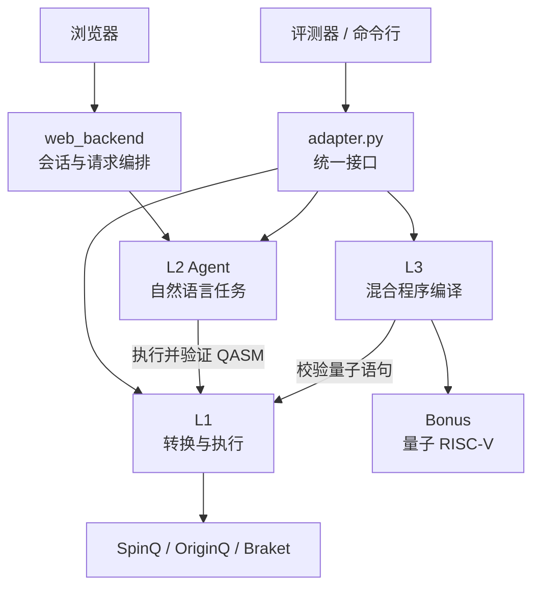
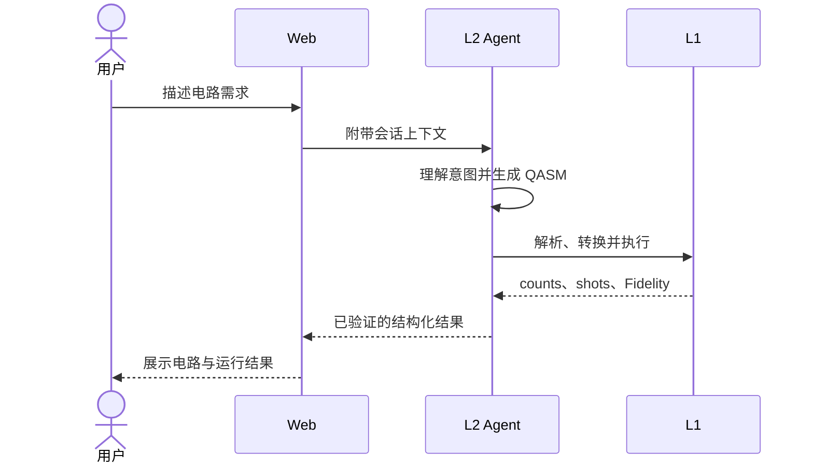
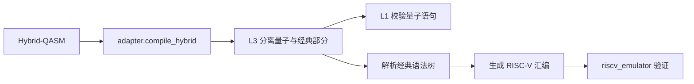

# LoomQ Starter Kit 架构说明

本文只介绍参赛提交目录 `starter_kit/`，不涉及仓库中的赛题材料、GitHub 工作流和组委会工具。

## 1. 目录一览

```text
starter_kit/
├── qasm_L1/                     # L1：QASM 解析、平台转换与量子后端执行
│   └── credentials/             # 真机凭证示例，真实密钥不会提交
├── l2_agent/                    # L2：自然语言量子 Agent 核心
│   ├── handlers/                # 生成、修复、解释、后端推荐等任务处理器
│   └── tools/                   # QASM 验证和后端选择工具
├── web/                         # 浏览器前端：引导、聊天和结果展示
│   └── js/                      # 按功能拆分的前端模块
├── web_backend/                 # Web 后端：HTTP、配置、会话和 Agent 编排
├── L3/                          # L3：Hybrid-QASM 与经典 RISC-V 编译
│   └── tests/                   # L3 单元测试
├── bonus_quantum_riscv/         # Bonus：自定义量子 RISC-V 指令和模拟器
│   └── tests/                   # Bonus 端到端测试
├── circuits/                    # 公开自测使用的 QASM 电路
├── examples/                    # SpinQ、OriginQ、Braket 的调用示例
├── evidence/                    # 真机、交互和产品化评分证据
│   └── files/                   # 截图、原始结果和实际执行电路
└── docs/                        # 启动、设计和测试记录等补充文档
```

`starter_kit/` 根目录的主要文件负责把这些模块连接起来：

- `adapter.py`：统一对外入口。
- `evaluator.py`：公开自测器。
- `web_app.py`、`run_l2.py`：网页和命令行启动入口。
- `llm_client.py`：模型请求客户端。
- `riscv_emulator.py`：L3 经典指令模拟器。
- `submission.yaml`：声明参赛层级和运行要求。
- `requirements.txt`、`Dockerfile`：定义运行环境。
- `backend_capabilities.json`：L2 使用的后端能力数据。

## 2. 总体结构

整个提交只有一个稳定的评测入口：`adapter.py`。它不实现具体业务，只把请求转交给对应模块：



模块之间并非完全独立：L2 会调用 L1 执行并验证模型生成的电路；L3 也会复用 L1 解析器检查量子语句。因此，L1 是底层能力，L2 和 L3 在它之上完成更高级的任务。

| 模块 | 接收什么 | 产出什么 | 主要联系 |
|---|---|---|---|
| Adapter | 评测请求 | 统一接口结果 | 把任务分给 L1、L2、L3 |
| L1 | OpenQASM 2.0 | 平台程序、执行结果 | 被 L2 和 L3 复用 |
| L2 | 自然语言需求 | QASM、解释或后端建议 | 调用模型，并用 L1 验证 |
| Web | 用户交互 | 对话和可视化结果 | 为 L2 增加会话层 |
| L3 | Hybrid-QASM | 量子操作和 RISC-V 汇编 | 用 L1 校验量子部分 |
| Bonus | L3 混合程序 | 自定义量子指令 | 扩展 L3 和经典模拟器 |

## 3. 模块说明

### 3.1 Adapter 与公开自测

`adapter.py` 是提交协议的实现，对外提供三组能力：L1 电路转换和运行、L2 自然语言对话、L3 混合程序编译。这样正式评测只依赖固定接口，不需要了解内部文件结构。

`evaluator.py` 通过 Adapter 执行公开测试：L1 检查目标程序、结果格式和 Fidelity；L2 检查回复中的 QASM；L3 检查编译后的分支语义。

简单来说：**Adapter 负责接单，各层负责执行，Evaluator 负责验收。**

### 3.2 L1：电路转换与执行

`qasm_L1/` 将同一份 OpenQASM 2.0 电路转换并运行在 SpinQ、OriginQ 或 Braket 上。

```text
QASM 文本 → parser.py → 通用 Circuit IR → emitter.py → 平台原生程序
                                                     ↓
                                                runners.py
                                                     ↓
                                          统一 ExecutionResult
```

- `parser.py` 解析 QASM，`ir.py` 保存统一的电路、量子门和测量结构。
- `gates.py` 定义支持的门及各平台映射，`emitter.py` 生成目标平台格式。
- `runners.py` 对接本地模拟器和真机 SDK。
- `execution.py` 统一 counts、shots、job ID 等结果，并导出脱敏后的证据。

上层只需调用 `adapter.transpile()` 或 `adapter.run()`，不需要关心平台差异。

### 3.3 L2：自然语言量子 Agent

`l2_agent/` 将用户的自然语言需求转换成可验证的量子任务。

`gateway.py` 调用 OpenAI-compatible 模型，把回复整理成结构化意图；`agent.py` 再通过 `registry.py` 分发给 `handlers/` 中的任务处理器，包括生成 QASM、修复 QASM、解释当前电路、推荐后端和请求澄清。

模型输出不会直接返回给用户：

- 电路生成和修复结果交给 `tools/qasm_validator.py`。
- Validator 调用 L1 本地运行，检查语法、测量、shots、counts 和 Fidelity。
- 后端推荐由 `backend_selector.py` 根据 `backend_capabilities.json` 筛选，而不是让模型随意决定。

因此这里的分工是：**模型负责理解和提议，确定性代码负责验证和决策。**

`llm_client.py` 处理底层模型请求，`run_l2.py` 加载本地配置并通过 `adapter.agent_chat()` 启动命令行交互。

### 3.4 Web：L2 的交互界面

`web/` 是无需构建的静态前端，负责首次使用引导、聊天输入、实验进度以及 QASM、counts、Fidelity 和后端信息展示。

`web_backend/` 负责本机 HTTP 服务、模型配置、用户学习偏好和多轮会话。它补充当前电路上下文后，仍然调用同一个 `l2_agent` 核心：

```text
浏览器 → Web 后端 → 会话与上下文 → L2 Agent → L1 执行验证 → 浏览器展示
```

`web_app.py` 只负责启动服务和打开浏览器。网页与命令行共用 Agent，网页只在外层增加了多轮对话和可视化体验。

### 3.5 L3：混合量子—经典编译

`L3/` 编译带有 `classical { ... }` 块的 Hybrid-QASM。

`quantum.py` 先分离量子和经典部分，并使用 L1 解析器检查量子语句；`lexer.py`、`parser.py` 将经典代码转换为语法树；`riscv_compiler.py` 再生成规定子集的 RISC-V 汇编。

最终输出包括两部分：按原顺序保留的量子操作，以及可由 `riscv_emulator.py` 执行的经典汇编。

### 3.6 Bonus：量子 RISC-V

`bonus_quantum_riscv/` 在 L3 基础上继续向下编译：它将量子门编码为自定义 RISC-V 机器指令，同时保留 L3 生成的经典汇编。

扩展模拟器继承已有的 `TinyRISCVEmulator`，加入量子态、量子门和测量执行能力，从而在同一个程序中完成量子计算、测量和经典条件分支。

### 3.7 电路、示例、证据与文档

- `circuits/` 为 `evaluator.py` 提供公开测试输入。
- `examples/` 展示 L1 三个平台的本地或真机调用方式。
- `evidence/` 保存可核验的真机结果和产品交互材料。
- `docs/` 记录各层设计、启动方法和测试过程。

这些目录不负责业务编排，而是为核心模块提供测试数据、使用示例和评分依据。

## 4. 完整调用关系

一次典型的网页电路生成请求会依次经过：



L3 请求则走另一条链路：



整体依赖方向可以概括为：**Adapter 统一入口，L1 提供底层量子能力，L2 和 L3 复用 L1，Web 包装 L2，Bonus 扩展 L3。**
