# LoomQ 完整使用流程

本文介绍参赛作品的三种使用方式。普通用户优先使用网页完成量子电路实验；开发者可以通过 Adapter 运行多平台电路；混合量子—经典编译则通过 L3 程序接口使用，目前不在网页中提供。

## 1. 流程总览

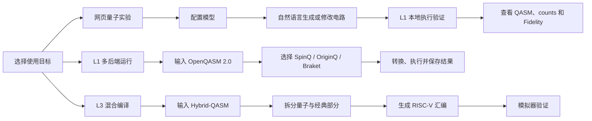

| 使用方式 | 适合用户 | 主要输入 | 最终结果 |
|---|---|---|---|
| 网页量子实验 | 初学者、教师 | 自然语言 | QASM、运行结果、概念解释 |
| L1 多后端运行 | 量子开发者 | OpenQASM 2.0 | 平台原生程序、统一 counts |
| L3 混合编译 | 编译与体系结构开发者 | Hybrid-QASM | 量子操作、RISC-V 汇编 |

## 2. 准备运行环境

推荐使用 Python 3.10。在 `starter_kit/` 目录中创建环境并安装依赖：

```bash
cd starter_kit
python3 -m venv .venv
source .venv/bin/activate
python -m pip install -r requirements.txt
```

Windows 使用：

```powershell
.venv\Scripts\activate
```

## 3. 网页量子实验流程

### 3.1 启动网页

在 `starter_kit/` 目录运行：

```bash
python3 web_app.py
```

程序默认启动 `http://127.0.0.1:8765` 并打开浏览器。主页提供“运行配置”“新手引导”和“进入工作台”三个入口。


### 3.2 完成模型配置

首次使用时点击“检查配置”。依次确认：

1. API 根地址可访问。
2. API Key 已填写。
3. 模型名正确。
4. 请求超时时间为正数，建议使用默认的 120 秒。

点击“保存并继续”后，配置写入本机 `.env.l2`。页面只显示 Key 是否已配置，不会回显 Key。

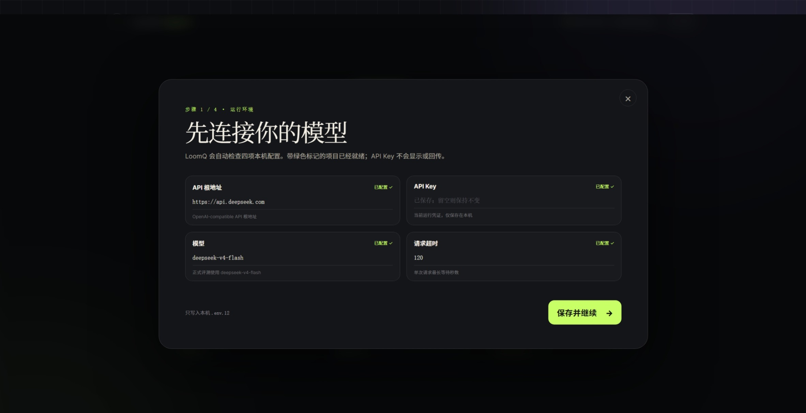

也可以在命令行中只检查配置，不调用模型：

```bash
python3 run_l2.py --check
```

### 3.3 选择学习方式

初学者可以从主页进入新手引导，选择自己的量子知识水平，并学习量子比特、量子门、量子电路和测量四个基础概念。已有量子基础的用户可以直接进入工作台。

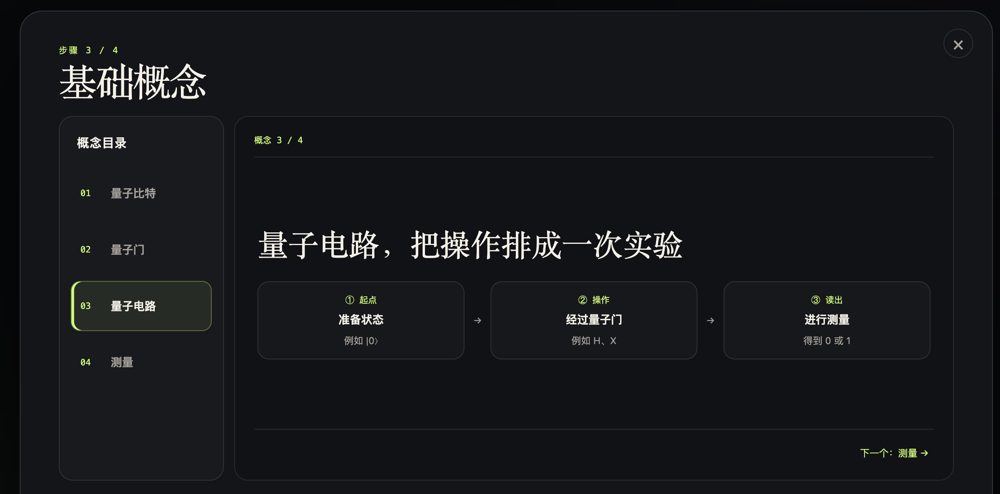

学习偏好会影响回答的讲解深度：初学者得到更多类比和概念说明，熟悉量子计算的用户会看到更直接的 QASM 与运行信息。

### 3.4 用自然语言生成并运行电路

进入工作台后，直接描述实验目标，例如：

> 生成一个 3 比特 GHZ 态并进行全测量。

系统的实际处理顺序如下：

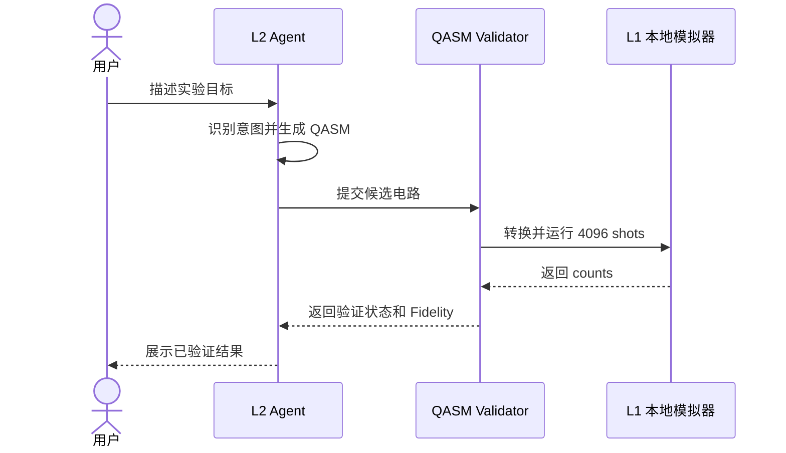

页面会同时展示：

- Agent 对电路作用的解释；
- 可复制的 OpenQASM 2.0；
- 是否已经实际运行并验证；
- 模拟器、shots、counts 和 Fidelity；
- 解释、修改和重新运行等后续操作。

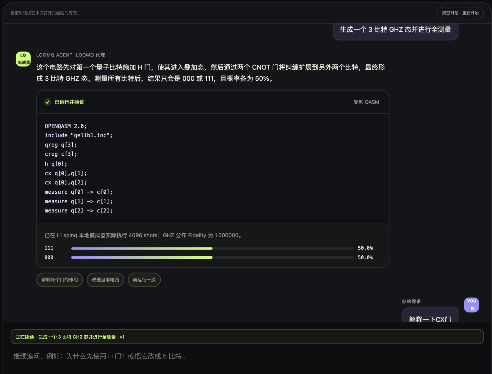

### 3.5 连续修改或修复电路

工作台会在当前浏览器会话中保存最近的有效电路。用户可以继续说“改成 5 比特”“解释 CX 门”或“修复这段代码”，不必重复粘贴完整上下文。

如果输入的 QASM 缺少声明、测量或存在语法问题，Agent 会尝试修复一次，再交给 L1 重新执行；只有通过验证的结果才显示为“已运行并验证”。

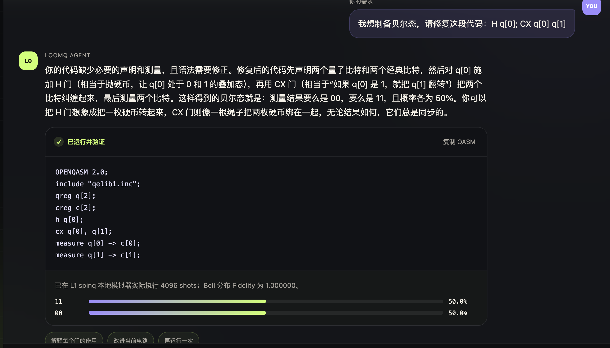

需要开始无关的新实验时，点击“清空对话·重新开始”，避免旧电路上下文影响新任务。

### 3.6 筛选合适的运行后端

用户可以用自然语言给出量子比特数、费用、排队和账号等条件，例如：

> 我要运行一个 26 比特电路，必须免费并且不能排队。

系统根据 `backend_capabilities.json` 确定性筛选后端，并展示支持规模、排队情况、费用和账号要求。这里由程序按能力表选择，不让语言模型凭空推荐。

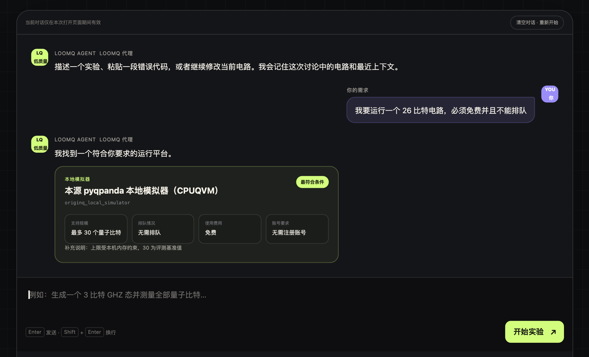

至此，网页主流程形成闭环：**提出目标 → 生成电路 → 实际验证 → 查看结果 → 继续解释或修改。**

## 4. L1 多后端运行流程

L1 面向需要直接处理 QASM 的开发者。准备一个 OpenQASM 2.0 文件后，使用统一 Adapter 选择目标平台。

### 4.1 本地运行

下面的命令将 Bell 电路转换为 SpinQ 格式，在本地模拟器执行 1024 shots，并保存平台程序和标准化结果：

```bash
python3 adapter.py circuits/bell.qasm \
  --target spinq \
  --shots 1024 \
  --output evidence/files/local-demo
```

将 `--target` 改为 `originq` 或 `braket`，即可复用同一份输入电路。统一结果包含：

```text
backend、job_id、shots、counts、bit_order、timestamp、meta
```

也可以分别运行三个最小示例：

```bash
python3 examples/run_spinq.py
python3 examples/run_originq.py
python3 examples/run_braket.py
```

### 4.2 真机运行与证据保存

真机运行需要先配置对应平台凭证和设备信息，再增加 `--real`：

```bash
python3 adapter.py circuits/bell.qasm \
  --target spinq \
  --shots 1000 \
  --real \
  --output evidence/files/L1-demo
```

程序会保存实际执行的平台程序、标准化结果和脱敏后的平台原始响应。结果中的 job ID 可用于平台侧复核。

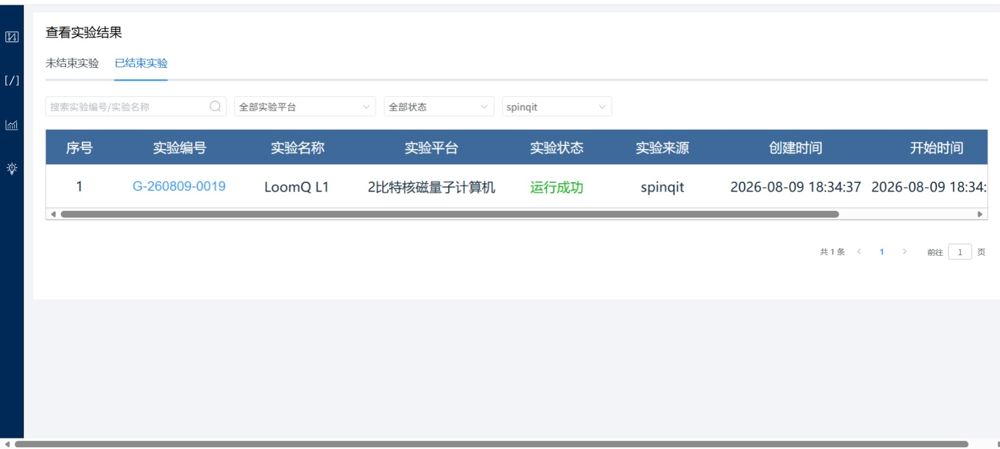

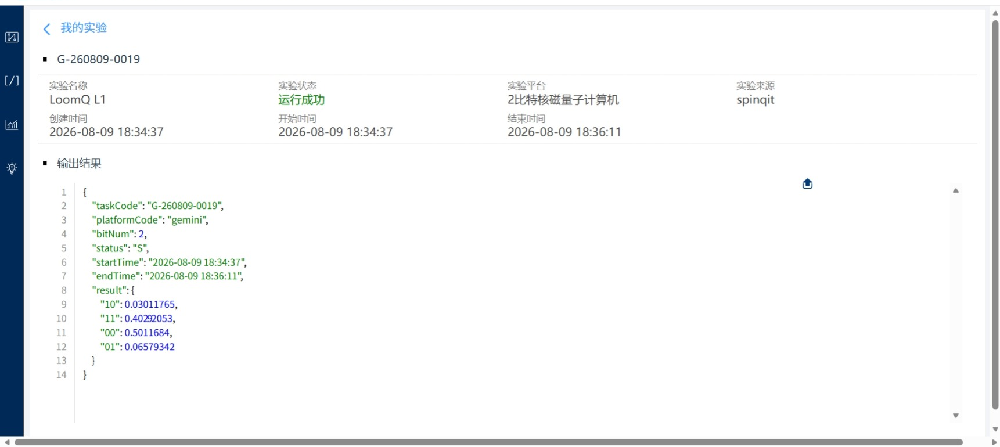

OriginQ 的证据同样包含任务状态、映射后的线路和测量分布：

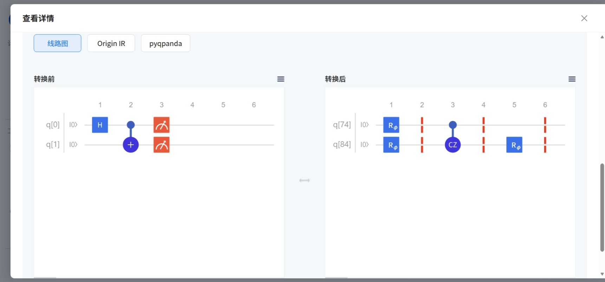

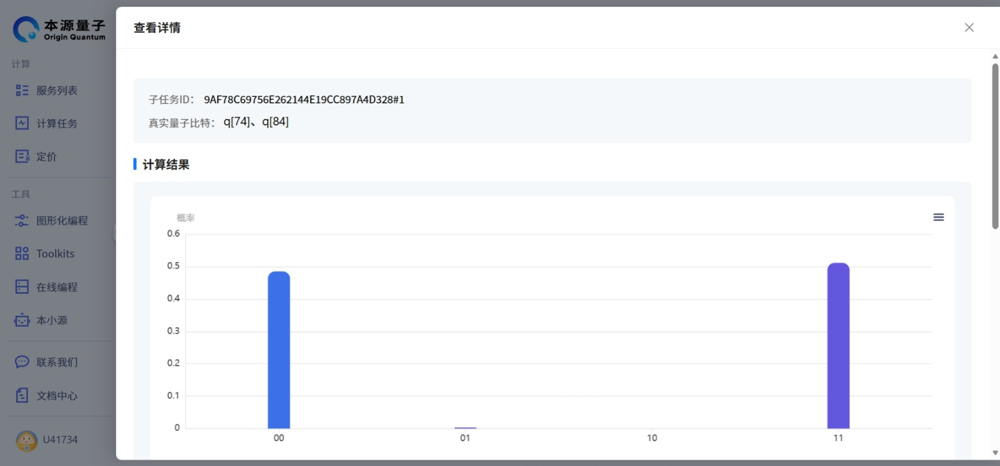

## 5. L3 混合量子—经典编译流程

L3 不通过网页使用。开发者需要编写带 `classical { ... }` 块的 Hybrid-QASM，并调用 `adapter.compile_hybrid()`。

```python
from adapter import compile_hybrid
from riscv_emulator import TinyRISCVEmulator

source = """OPENQASM 2.0;
include "qelib1.inc";
qreg q[1];
creg c[1];
h q[0];
measure q[0] -> c[0];
classical {
  if (c[0] == 1) { r1 = 7; } else { r1 = 3; }
}
"""

quantum_operations, assembly = compile_hybrid(source)
print(quantum_operations)
print(assembly)

# 用测量结果 1 验证经典分支。
emulator = TinyRISCVEmulator()
emulator.load_program(assembly)
emulator.set_register("x10", 1)
print(emulator.execute())  # x1 应为 7
```

内部流程是：

```text
Hybrid-QASM
  → 分离量子操作与 classical 块
  → 使用 L1 解析器校验量子语句
  → 将经典语句解析成语法树
  → 编译为 RISC-V 汇编
  → 将测量值映射到 x10 及后续寄存器
  → 使用 TinyRISCVEmulator 验证分支结果
```

运行公开 L3 自测：

```bash
python3 evaluator.py --level l3
```

`bonus_quantum_riscv/` 还可以把量子门编码为自定义量子 RISC-V 指令，并在扩展模拟器中联合执行量子门、测量和经典分支。

## 6. 完成标准

| 流程 | 完成标志 |
|---|---|
| 网页实验 | 页面显示“已运行并验证”，并给出 QASM、counts 和验证说明 |
| L1 本地运行 | 返回统一结果，且 counts 总数等于 shots |
| L1 真机运行 | 平台任务成功，并保存 job ID、原生程序和原始结果 |
| L3 混合编译 | 返回量子操作和 RISC-V 汇编，模拟器分支结果符合预期 |

若要进行一次完整展示，推荐依次演示：**首次配置 → 新手引导 → 生成 GHZ 电路 → 修改为其他电路 → 按约束推荐后端 → 展示 L1 真机证据 → 运行 L3 公开自测。**
